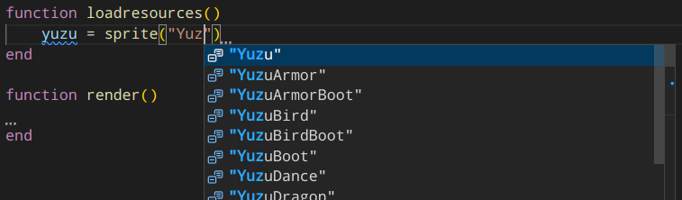
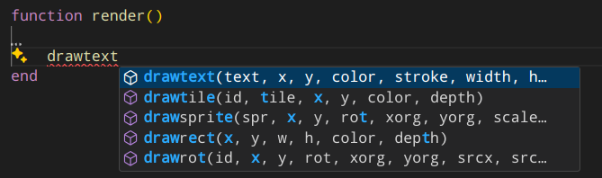

# Inari API (Lua Addon)

This is the Lua specification of Inari API,
the Lua interface for writing minigames for [Kitsune Tails][1].

Coupling this with a Lua Language Server
will automatically grant you auto-complete,
information about global declarations,
and type checking against the API.





[1]: https://kitsunegames.com/games/kitsunetails/

## How to use

1. Install a Lua Language Server to your IDE of preference.
   For Visual Studio Code, install the [Lua extension][2].
2. Checkout this repo to some place, e.g. `/home/to/my/lua-addons/`.
3. In your minigame project (e.g. at `KitsuneTails/scripts/myminigame/`),
   add a `.luarc.json` file which includes the addon and the globals:

   ```json
   {
      "$schema": "https://raw.githubusercontent.com/LuaLS/vscode-lua/master/setting/schema.json",
      "Lua.workspace.userThirdParty": [
         "/home/to/my/lua-addons"
      ],
      "Lua.workspace.library": [
         "/home/to/my/lua-addons/inari"
      ],
      "Lua.diagnostics.globals": [
         "accept",
         "cancel",
         "init",
         "loadresources",
         "menu3",
         "navigate",
         "render",
         "update"
      ]
   }
   ```

Alternatively, you can copy `config.json` and `library` to your minigame project directly
(e.g. you would have `KitsuneTails/scripts/myminigame/config.json`
and `KitsuneTails/scripts/myminigame/library/inari.lua`).
The former approach is a bit cleaner because you do not have to replicate
`library` and `config.json` on every new minigame.

[2]: https://marketplace.visualstudio.com/items?itemName=sumneko.lua

## Attribution and Licensing

This work is licensed under [CC BY-NC 4.0 ](https://creativecommons.org/licenses/by-nc/4.0/). Permission is granted to use, distribute, and make further adaptations
for non-commercial purposes, retaining the reference to the repository of origin.

This work was derived from the Inari API documentation by [Kitsune Games LLC][3], with permission.

[3]: https://kitsunegames.com
